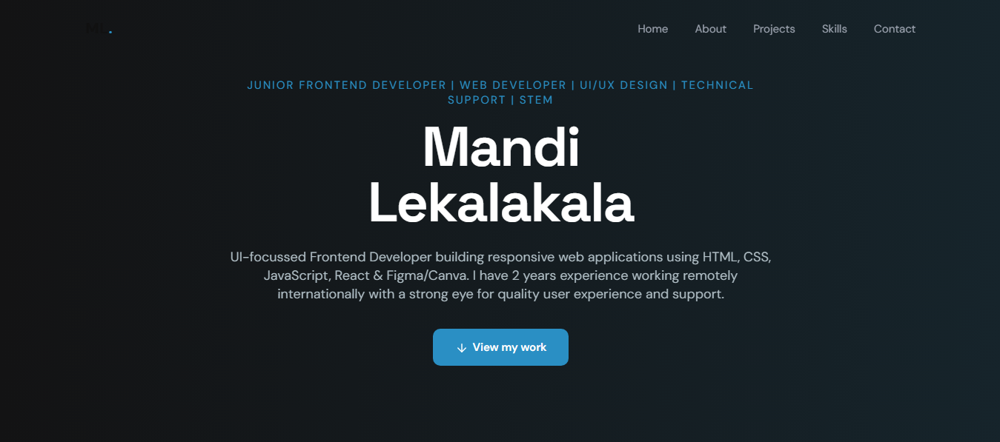
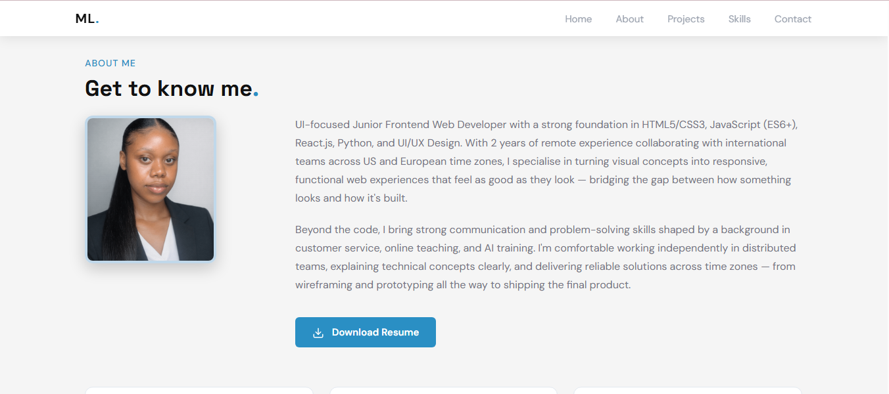
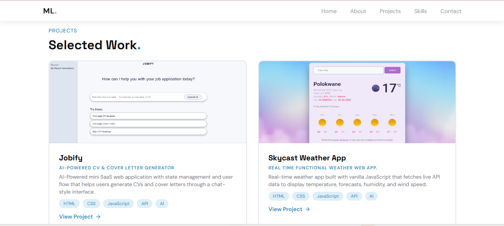
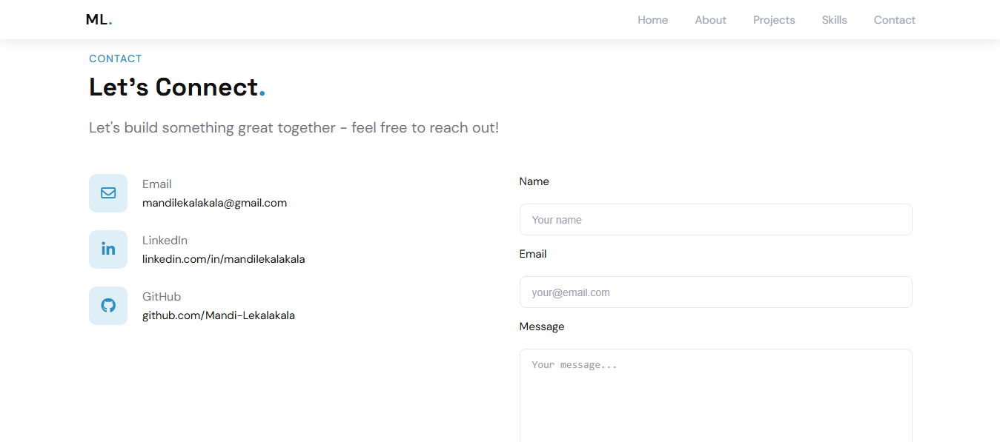

# Mandi Lekalakala — Personal Portfolio 🌐
A responsive personal portfolio website built with HTML, CSS, and JavaScript. Designed to showcase my frontend development projects, skills, and experience as a UI-focused Junior Frontend Developer.

🔗 **Live Site:** https://mandi-lekalakala.netlify.app/

---

## Features
- Fully responsive layout for mobile and desktop
- Sticky navigation with smooth scroll section linking
- Mobile hamburger menu
- Hero section with a clear personal value proposition
- About section with downloadable resume
- Projects showcase with live links
- Skills breakdown by category
- Contact section with working contact form

---

## Preview

---

## Built With
- HTML5
- CSS3
- JavaScript
- Netlify (deployment)

---

## Sections
| Section | Description |
|---------|-------------|
| `#home` | Hero with headline and CTA |
| `#about` | Bio, remote experience highlights, resume download |
| `#projects` | Selected work with live project links |
| `#skills` | Frontend, backend, tools, and soft skills |
| `#contact` | Email, LinkedIn, GitHub, and contact form |

---

## Projects Showcased
| Project | Description |
|---------|-------------|
| **Jobify** | AI-powered CV & cover letter generator with chat-style interface |
| **Skycast Weather App** | Real-time weather app using live API data |
| **Amanda's Beauty Bar** | Responsive multi-page client website with booking flow |

---

## Project Focus
This portfolio was built to present my work and skills as a junior frontend developer in a clean, professional format. Key focus areas included responsive design, smooth UX, consistent visual branding, and clearly communicating my value as a developer to potential employers and clients.
